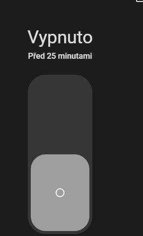

# Three State Switch Card

A polished three-position Home Assistant Lovelace card for `input_select` and `select`
entities that expose exactly three options, typically **On / Auto / Off**.



The screenshot above is captured from the included Home Assistant test dashboard.
It shows the compact minimal card in its real Home Assistant rendering.

Try the interactive [live demo](https://moukas.github.io/three-state-switch-card/).
It simulates Home Assistant state changes in the browser and never controls real devices.

## Features

- Vertical and horizontal layouts
- Direct tap selection and drag interaction
- Automatic option loading from the entity
- Custom values, labels, icons, and colors
- Visual card editor for Lovelace
- Section dashboard and resize support
- Keyboard navigation and ARIA attributes
- Haptic feedback in the Home Assistant companion app
- Optimistic UI updates with error handling
- No runtime dependencies

## Quick Start

```yaml
type: custom:three-state-switch-card
entity: input_select.heating_mode
name: Heating
orientation: vertical
options:
  - value: "On"
    label: "On"
    icon: mdi:power
    color: var(--success-color)
  - value: "Auto"
    label: "Auto"
    icon: mdi:autorenew
    color: var(--primary-color)
  - value: "Off"
    label: "Off"
    icon: mdi:power-off
    color: var(--disabled-text-color)
```

Design notes are in [docs/DESIGN.md](docs/DESIGN.md).
Installation is in [docs/INSTALLATION.md](docs/INSTALLATION.md).
Configuration options are in [docs/CONFIGURATION.md](docs/CONFIGURATION.md).
Development notes are in [docs/DEVELOPMENT.md](docs/DEVELOPMENT.md).

## Project Status

Version `0.1.0` is aligned for a HACS custom repository workflow:

- HACS metadata is present in `hacs.json`.
- Validation CI is configured with `hacs/action` for `category: plugin`.
- Release CI publishes the built `dist/three-state-switch-card.js` bundle.
- Card picker metadata is registered through `window.customCards`, including this
  repository's documentation URL.
